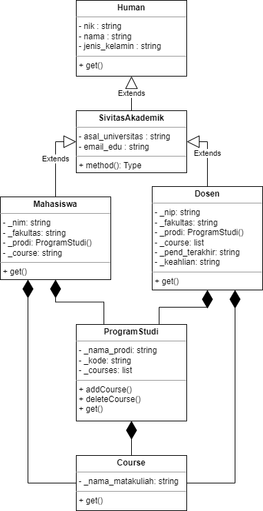
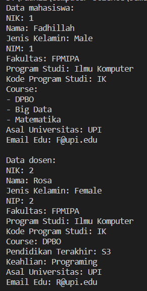

# LATIHAN2DPBO2023
Buatlah program berbasis OOP menggunakan bahasa pemrograman C++ dan Python  yang mengimplementasikan konsep inheritance, composition, dan array of object pada kelas-kelas tersebut:
- Mahasiswa: NIM, nama, jenis_kelamin, fakultas, prodi
- Human: NIK, nama, jenis_kelamin
- SivitasAkademik: asal_universitas, email_edu
- Dosen: NIP, nama, jenis_kelamin, fakultas, prodi, pend_terakhir, keahlian
- Course: nama_matakuliah, 
- Program Studi: nama_prodi, kode, course
---
- -
Saya Muhammad Fadhillah Nursyawal NIM 2107135 mengerjakan soal Latihan 3 
dalam mata kuliah Desain Pemrograman Berorientasi Objek 
untuk keberkahanNya maka saya tidak melakukan kecurangan seperti yang telah dispesifikasikan. Aamiin.


## Desain Program
Program dibuat dalam bahasa `C++`, `Java`, `Python`, dan `PHP`. tiap bahasa mempunyai desain program yang sama (kecuali `PHP`). Program berisi beberapa file kelas, diantaranya:
1. **Human** > kelas Human
2. **Mahasiswa** > kelas Mahasiswa
3. **SivitasAkademik** > kelas Sivitas Akademik
4. **CRUD** > kelas CRUD, untuk membuat, mengubah, dan menghapus data. data ini akan disimpan dalam variabel list CRUD
5. **Table** > kelas tabel, untuk membuat dan menampilkan data list dengan tabel  

terakhir diikuti dengan file `main.` pada program.

Tiap kelas memiliki atribut dan methodnya masing masing

### Atribut
1. **Human** > `NIK`, `nama`, `jenis_kelamin`
2. **Mahasiswa** > `NIM`, `nama`, `jenis_kelamin`, `fakultas`, `prodi`
3. **SivitasAkademik** > `asal_universitas`, `email_edu`

    tiap atribut pada kelas diatas bertipe data `string`, karena tidak perlu proses menghitung jadi semuanya disamakan.

4. **CRUD** > 
    - `data` > bertipe data `vektor/list of class` untuk menyimpan data

5. **Table** >
    - `headers` > bertipe data `list of string` untuk menyimpan nama variabel dari data
    - `columnWidths` > bertipe data `list of integer` untuk menyimpan lebar tabel
    - `border` > bertipe data `string` untuk menyimpan border tabel

### Method
1. **Human** > 
2. **Mahasiswa** > 
3. **SivitasAkademik** > 

    [1, 2, 3] `konstruktor` > atribut diset langsung didalam konstruktor, jadi saat memanggil dalam main harus langsung menyimpan data dalam parameter.
    ```c++
    SivitasAkademik sivitas(NIK, nama, jenis_kelamin, NIM, fakultas, prodi, asal_universitas, email_edu);
    ```

4. **CRUD** > 
    - `create` > untuk membuat dan menyimpan data ke dalam list
    - `update` > untuk memperbarui data dari index yang diinput
    - `remove` / `delete` > untuk menghapus data dari index yang diinput
    - `getFieldValues` > untuk return data list 2 dimensi dari index dan banyak data, tipe data `list of list`

5. **Table** >
    - `setHeaders` > untuk menyimpan data variabel untuk dijadikan header
    ```c++
    table.setHeaders({"No", "NIK", "Name", "Jenis Kelamin", "NIM", "Fakultas", "Prodi", "Universitas", "Email"});
    ```
    - `setBorderTable` > untuk return border table yang sudah dibuat, tipe data `string`
    - `setWidth` > untuk menyimpdan data lebar tiap kolom tabel
    ```c++
    table.setWidths({3, 10, 15, 15, 10, 15, 15, 20, 20});
    ```
    - `displayHeaders` > untuk menampilkan header table
    - `displayData` > untuk menampilkan data table
 
**catatan** : *display data menggunakan pola tabel untuk menampilkan data mahasiswa pada method `displayData` dengan `displayHeaders`. tiap baris data terdapat kolom number untuk menandakan data ke berapa, nanti pada saat pilihan menu ubah atau hapus data, user harus menginputkan `number` berapa pada tabel yang akan dioperasikan datanya*

### Inheritance
Desain program mengimplementasikan konsep `Multi-level Inheritance` pada kelas-kelas utama.
1. **Human** > sebagai parent dari kelas `Mahasiswa`
2. **Mahasiswa** > sebagai child dari kelas `Human` dan parent dari kelas `SivitasAkademik`
1. **SivitasAkademik** > sebagai child dari kelas `Mahasiswa`

`Human` menjadi kelas paling atas karena kelas human menjadi dasar dari kelas `Mahasiswa` dan student mempunyai sebagian atribut yang sama dengan human yaitu nama dan jenis kelamin. alasan lainnya karena mahasiswa merupakan human (manusia).

lalu kelas dari `SivitasAkademik` merupakan child dari kelas `Mahasiswa` karena sivitas akademik memiliki mahasiswa sebagai pelajar

## Penjelasan Alur
Setiap bahasa mempunyai Alur program yang sama. Setelah melakukan execute program, sistem akan menampilkan menu
```
1. Add Student > menambahkan data mahasiswa
2. Modify Student > mengubah data mahasiswa
3. Delete Student > menghapus data mahasiswa
4. Display Student List > menampilkan data mahasiswa dengan tabel
0. Exit > keluar
```
lalu user menginput pilihan menu yang di inginkan. Jika user memilih `-> 1` maka user diminta untuk input data

lalu data berhasil ditambahkan. jika user memilih `-> 4` sistem akan menampilkan data mahasiswa berupa `tabel` (tabel terlampir dalam dokumentasi).

jika user memilih `-> 2` maka user diminta untuk menginput `Number` yang akan diubah datanya. Lalu user diminta untuk menginput data yang baru.

jika user memilih `-> 3` maka user diminta untuk menginput `Number` yang akan dihapus datanya.


## Dokumentasi Execute Program (C++)
- **Diagram UML**  


- **python**


