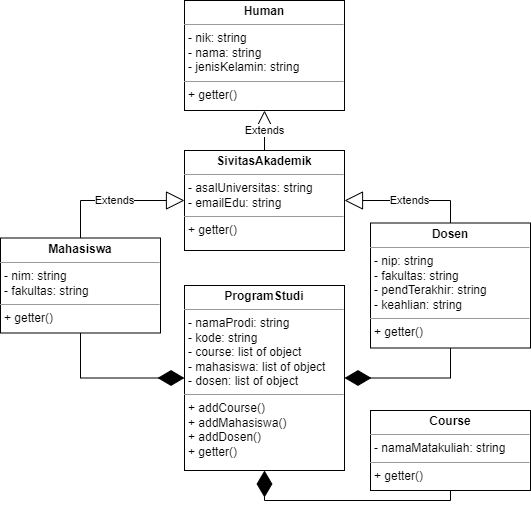
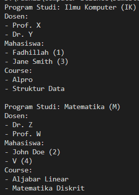

# **LATIHAN2DPBO2023**
Buatlah program berbasis OOP menggunakan bahasa pemrograman C++ dan Python  yang mengimplementasikan konsep inheritance, composition, dan array of object pada kelas-kelas tersebut:
- Mahasiswa: NIM, nama, jenis_kelamin, fakultas, prodi
- Human: NIK, nama, jenis_kelamin
- SivitasAkademik: asal_universitas, email_edu
- Dosen: NIP, nama, jenis_kelamin, fakultas, prodi, pend_terakhir, keahlian
- Course: nama_matakuliah, 
- Program Studi: nama_prodi, kode, course
---
- -
Saya Muhammad Fadhillah Nursyawal NIM 2107135 mengerjakan soal Latihan 4 
dalam mata kuliah Desain Pemrograman Berorientasi Objek 
untuk keberkahanNya maka saya tidak melakukan kecurangan seperti yang telah dispesifikasikan. Aamiin.

## **Desain Program**

***Catatan:*** *`getter()` pada desain `UML` tersebut merupakan getter dari setiap `atribut` pada setiap `kelas`, selain itu `construktor` dan `destruktor` tidak saya cantumkan dalam desain UML karena sudah pasti ada.*

### **Inheritance dan Composite**
- **SivitasAkademik is a Human:**  
Sivitas akademik merupakan sekelompok orang yang berinteraksi di lingkungan akademik, jadi saya dapat simpulkan bahwa sivitas akademik `inheritance` terhadap manusia  
- **Mahasiswa is a SivitasAkademik:**  
Mahasiswa sudah pasti merupakan sivitas akademik karena mahasiswa sudah dari bagian dari sivitas akademik itu sendiri. jadi dapat disimpulkan bahwa Mahasiswa `inharitance` terhadap sivitas akademik.
- **Dosen is a SivitasAkademik:**  
Dosen juga sama merupakan bagian dari sivitas akademik itu sendiri. jadi dosen `inheritance` terhadap sivitas akademik.  

***Tambahan:*** *Dalam desain terdapat `Multi-level` Inheritance dari `Human` parent yang paling atas lalu ke `SivitasAkademik` childnya dan kebawah lagi yaitu `Mahasiswa` dan `Dosen` yang menjadi Child paling akhir.*
- **ProgramStudi has a Dosen:**  
- **ProgramStudi has a Mahasiswa:**
- **ProgramStudi has a Course:**  

dari sudut pandang program studi saya menyimpulkan bahwa program studi itu memiliki beberapa dosen, memiliki beberapa mahasiswa, dan memiliki mata kuliah sesuai dengan program studinya. jadi ya kenyataannya seperti itu, jadi ProgramStudi ini `Composite` terhadap Dosen, Mahasiswa, dan Course

## **Penjelasan Alur**
Karena data yang dimasukan adalah `Hard Code`, jadi didalam programnya saya sudah memasukan data seperti data Mahasiswa, Dosen, Mata kuliah, Prodi beserta dengan atributnya. lalu data ini digabungkan dalam kelas ProgramStudi, nah ini menjadi objek untuk dimasukan juga kedalam `list` supaya bisa banyak datanya. sehingga saat ditampilkan akan menampilkan data data tersebut, saya mengimputkan jumlah 2 data pada C++ jadi hasilnya dapat dilihat pada gambar.

## Dokumentasi Execute Program (C++)
- **C++**

